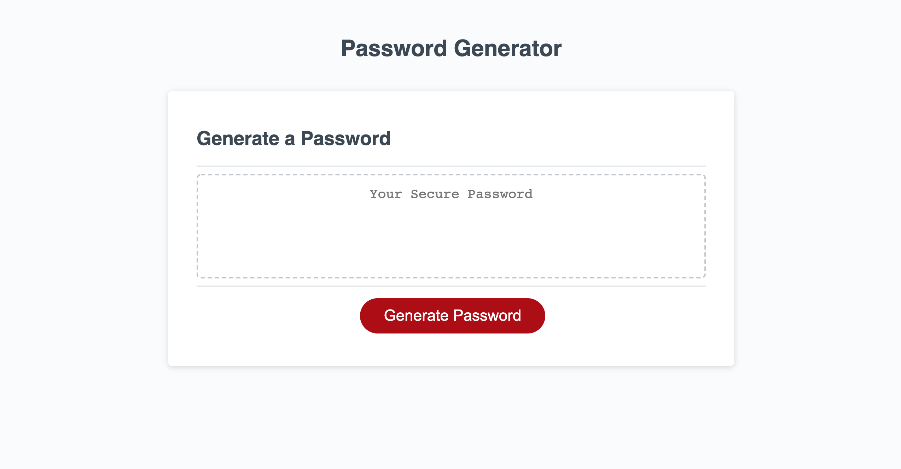
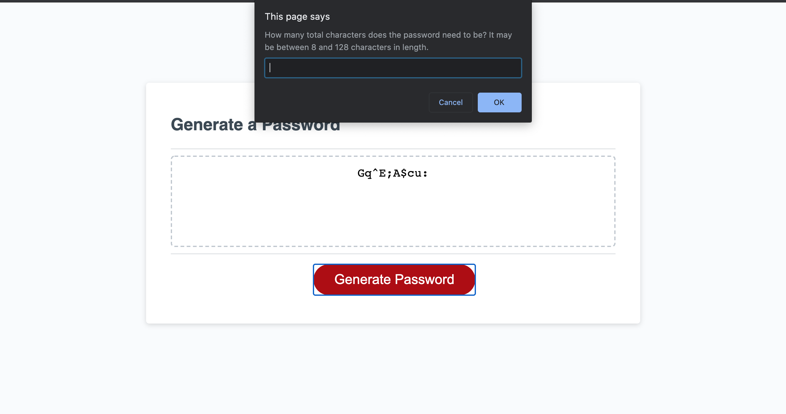
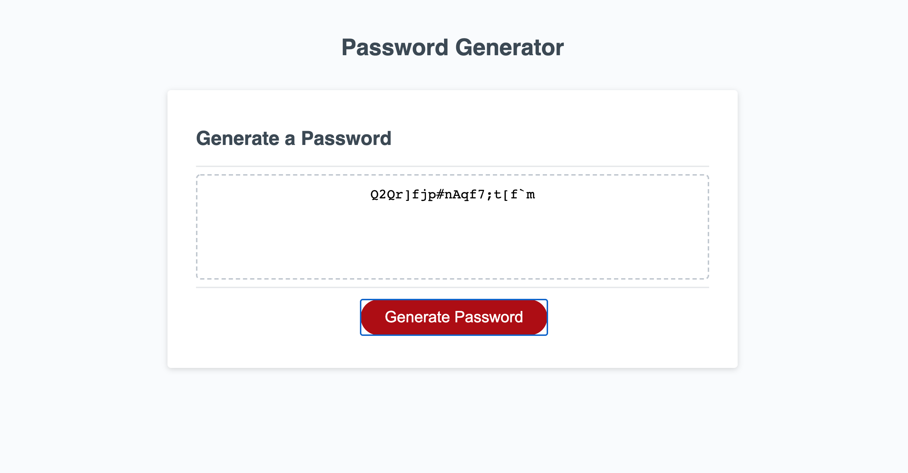

# Password Generator

## Purpose

To allow a user to generate a password according to their specifications. They decide the length of the password and which character sets to use. Character sets include the following:

- Uppercase letters
- Lowercase letters
- Numeric values
- Special characters, i.e "!", "&", etc.

## [Link to Application](https://loganmerchant.github.io/password-generator/)

## Languages Used

- HTML
- CSS
- JavaScript

## Process & Reflection

Setting up the initial JavaScript for this project was fairly straightforward. I created `var`s that I thought would need to be called, created all of the user prompts, and the general "skeleton" of the project within a few minutes.

Setting up the arrays for the character sets did not immediately come to mind, but once they did I felt that the rest of the project became a matter of getting said arrays to show up in a string according the user's requirements.

Google helped me quite a bit for this challenge. It provided me with the syntax for certain things that provided essential functions, like `.toString` and `.join`.
I feel much more confident with JavaScript after this challenge than I did before.

## Screenshots

